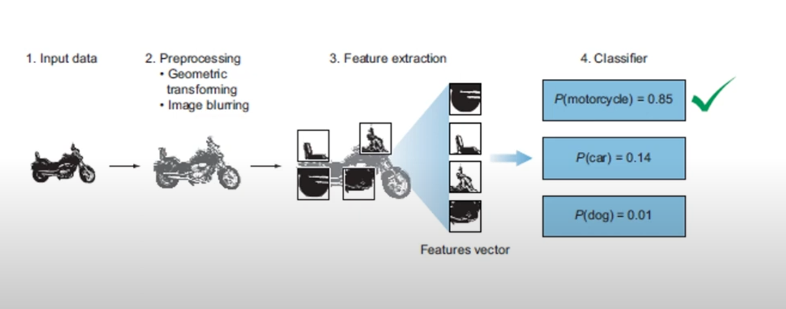

# **`Computer vision`**

### `Source -> Sensing device -> Interpretation device -> Interpretation or prediction`

## How model predict picture

### `Input data -> Preprocessing (geometric transformation, image blurring) -> Feature extraction -> Classifier`

## Usecase

1. Face detection: This field is saturated.
    1. Face Recognition Vendor Test (FRVT)
2. Smile detection
3. Biometrics
    1. Fingerprint spoof detection
4. OCR (Optical Character Recognition): Handwritten text or other text to digitalized text conversion.
5. Automotive transport safety.
6. Augmented Reality (AR)
7. Vision for robotics, space exploration
8. Satellite imaging
9. Medical imaging
    1. Classification, Detection and Segmentation (suggested for research paper).
    2. Animation and VFX
        1. GAN
        2. Diffusion
10. Human computer interaction

### Topics to be learn

1. Deep learning and computer vision
    1. Various task of computer vision
2. Computer vision models
    1. CNN
    2. Vision transfer
3. Data
4. Label
5. Dataset, Data loader and custom data loader
6. Classification based task
    1. Image classification
    2. Image segmentation
    3. Object detection
7. Transfer learning
8. Generative AI
    1. GAN (Generative Adversarial Network)
    2. Neural Style Transfer
    3. Diffusion (good future)
9. Image restoration
10. Image denoising
11. Image super-resolution
12. Alternate supervision
    1. Weakly, semi and self-supervised learning

## Limitations

1. **Sensor**: Can create noise.
2. Viewpoint variations
3. Changing lighting conditions
4. Issue of scale

-   Images are stored in multi dimensional arrays.
-   2D images are grayscale image or black-white image.
-   3D images are colorful images (RGB)