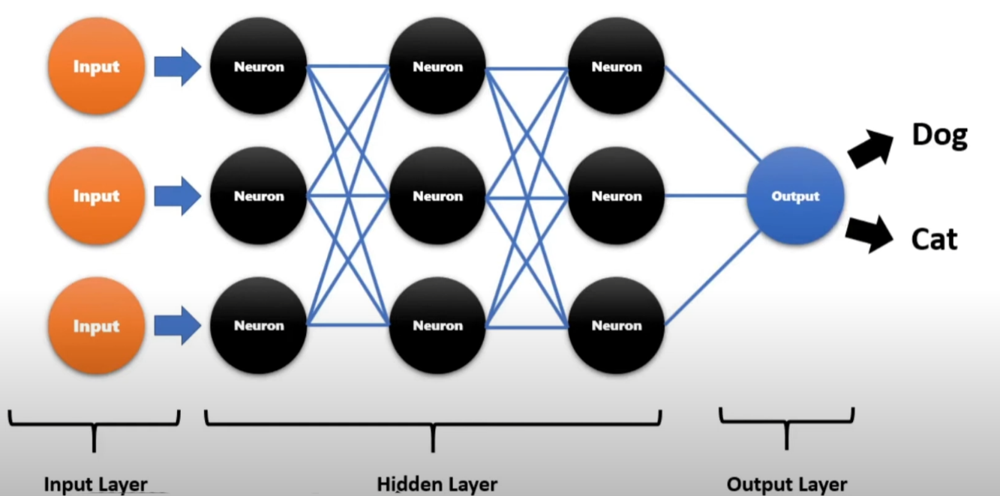

> **```Number of total layers in a neural network = Count of hidden layers + output layer```**

- Logistic regression is like a single neural network. 
- Each neuron of a neural network works on a specified sub-task.
- If any mistake happens
  - Error will be reported or propagated to individual neurons thus they can learn about the accurate result. This process is known as **'Backward Error Propagation'**.
- This is how deep learning work using utilizing trial and error process.

## Perceptron 

