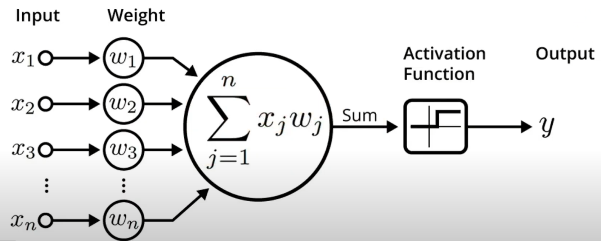
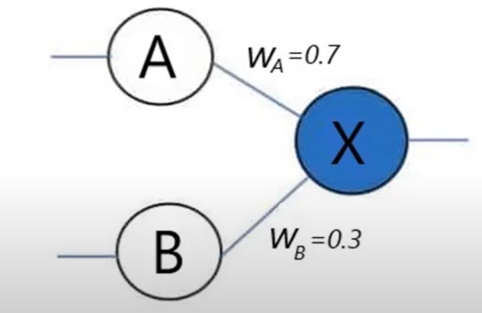

## Perceptron

-   Perceptron is a single neuron.
-   **Summation**: <ins>Weighted sum of input and bias</ins>. It will receive input and multiply with a weight inputs using the following formula:
    -   $S =sum(wi * xi)$
-   Activation function and give output.
-   If the result doesn't seems to be appropriate it will eventually use another way call backward propagation to adjust the weights, thus the performance of the prediction improves.

## ANN

-   Summation function is the input of activation function.
-   The activation function is not only bound to the last or output layer. It applied across all hidden layers.
-   Activation function are responsible for achieve non-linear result.

## Components of neural network

1.  **Weights**: Represents the strength of the connection between two neurons. Weight decides how much each input neuron influences the output or succeeding neuron. As much the weight value increases it represent a greater influence between two neurons.

    

    Here neuron 'A' will have more influence on neuron 'X' as compare to neuron 'B'.

    Weight is learnable parameter, a parameter that can be changed or updated by new values on the training process to better predict the output.

2.  **Bias**: Bias help offsetting the result.

3.  **Error**: (Expected value - Outcome or predicted value)

    -   To reduce error 'weight updating' technique take place.
    -   For how many iteration or cycle the weight updation should be performed is determined by **'epoch'**.
    -   **Global minima**: The last stage of the error after that error can't be minimized.

4.  **Activation function**: Activation functions introduce non-linearity into the model, allowing it to learn complex patterns in data. There are several different activation functions, in practice there is no strict rule to use a particular activation function, but non-linear activation functions suits best for real world scattered dataset. It depends on which activation function suits better for your task.

5.  **Learning rate**: কত speed এ weight adjust হবে । How fast our model will learn. Never choose a higher learning rate because sometime it will not hit the minimal point. Take smaller steps. In contrast, when the learning rate is too low, the training become time consuming. To pick a optimal learning rate value, start off with a smaller learning rate and gradually increase or decrease value to see how the model is performing.
