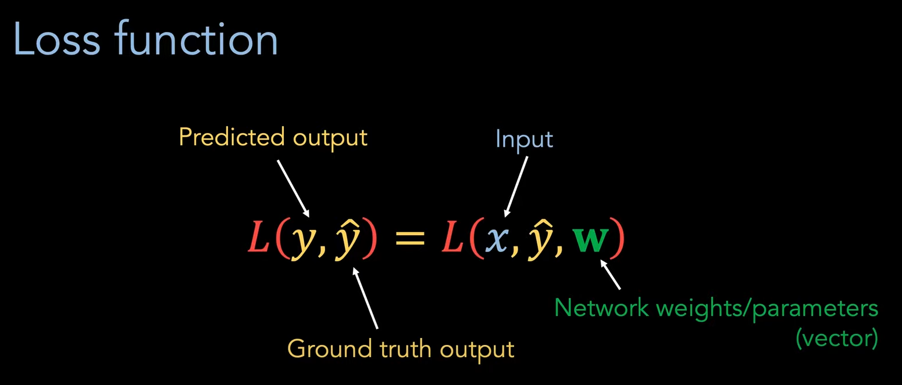

-   Bias and activation function required in each hidden layer
-   The activation function controls which neurons contribute to the next layer's computation. Without this "supervision," all neurons might contribute equally, which could lead to inefficient learning and poor model performance.

## Neurons and Activation
1. **Neuron's role**: A neuron in a neural network computes a weighted sum of its inputs (plus a bias term). The result of this sum is then passed through an activation function, which "decides" whether the neuron should be "activated" (i.e., fire) or not.

2. **Activation function's role**: The activation function applies a mathematical transformation to the neuron's output. It introduces non-linearity into the model, allowing the network to learn and model complex patterns in data. Depending on the activation function and the neuron's weighted input, the neuron may produce a value that influences downstream neurons or not.

