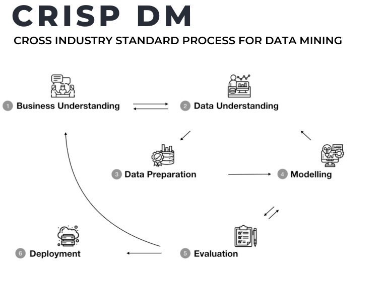

# **```How to ace when developing a supervised ML model```**

> **Problem solving part**: The following three steps are most important and take more time and create hardship.

1. Understand the problem statement and figure out which ML paradigm to use.
2. Finding data.
3. Data understanding and domain expertise. 

> **Implementation part (using ML algorithms)**

4. Data selection, loading and cleaning.
   1. Feature selection.
   2. Handling missing values.
   3. Outlier value handling.
   4. Data type conversion.
5. Train ML model.
   1. Selecting ML algorithms.
   2. Data distribution.
      1. X or input data.
         1. **X train data (covers almost 60% data)**
         2. **X validation data (20% data)**: This reservation is very often overlooked, it is important to check whether our model training is going in the right direction or should we reevaluate training data instead. **This phase is just like practicing question right after learning a topic.** So, if our training is not well we might not perform good in validation phase, that means we need to revisit the training may be increasing the number of accurate data or figure out any bottleneck that may occurred.
         3. **X test data (20% data)**: At the final stage, test data evaluate our model performance.
      2. Y or output data.
         1. Y train data. (80% data)
         2. Y test data. (20% data) 
6. Test/evaluate ML model.
7. Model deployment (MLOps).

&nbsp;

# **```CRISP DM Methodology```**



