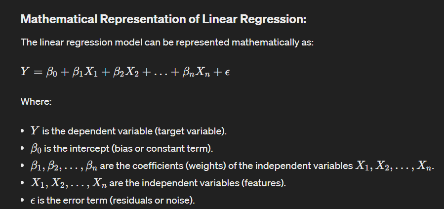

# **`Regression analysis`**

> A regression analysis makes it possible to infer or predict a variable (Depended variable or **Criterion**) on the basis of one or more other variables (Independent variables or **Predictors**).

&nbsp;

# **`Linear Regression`**

-   It's a prediction algorithm.
-   **Aim**: To find the best fit line with minimal error. Here, **`error = predicted point - actual point`**

-   Mean is best fit line.

### Types

1. **Simple linear regression**: One feature and one target.
2. **Multiple linear regression**: Multiple feature and one target.

### Hypothesis

-   **Model perspective**: Initial version of a model proposed after being trained using test dataset. The hypotheses model than tested, optimized and refined through the process of training and validation based on unseen test data.
-   **Mathematical perspective**: Mathematical assumption that establish relationship between feature and target.

## Formula of linear regression

**`Y = mX + c`**

Here,

1. **Slop or m** refers the value that determine changes in variable 'X' how much affect in value 'Y'.
2. **c** is Y intercept.

### Cost function

Cost function represents the error between the actual value and the predicting value.

## Mathematical representation

