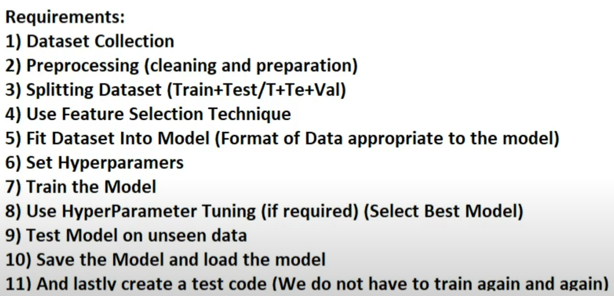

> # **`Class 13`**

1. **Error**: The difference between actual output value and predicted output value.
2. **Loss**: The error of a single data point.
3. **Cost**: The average loss of an entire dataset.

> Cost is the indicator for how good a model's performance it.  
> When cost is high it means the model is less likely to be predict desired solution.

-   Good performance == Lower cost
-   Bad performance == Higher cost

## Gradient Descent

-   It is an algorithm that is used for reducing cost in the model.
-   Gradient descent continuously updates weight iteratively to descend the slope of the error curve until we get to the point with minimum error.
-   When gradient value is 0 it indicates the minimum cost.
-   **Variations**: Batch Gradient Descent (BGC), Stochastic Gradient Descent (SGD), Mini-batch GD .

## How gradient descent works

-   The model initialized with parameters such as weights and biases randomly 👉 Forward propagation 👉 computing cost 👉 Backward propagation (using gradient descent algorithm) 👉 Updating parameter values (backpropagation) 👉 Learning rate (How fast parameter get updated)

-   The learning rate is like the speed at which a machine learning model learns. The learning rate, denoted by the symbol α, is a hyper-parameter used to govern the pace at which an algorithm updates or learns the values of a parameter estimate.

    -   If the learning rate is too high, the model might miss the best solution because it's jumping too fast.
    -   If it's too low, the model learns very slowly and takes a long time to improve.

1. **Machine learnable parameters** – The parameters that the algorithms learn/estimate on their own during training for a particular dataset.

2. **Hyper-parameter** - Hyper-parameters are variables that machine learning engineers or data scientists provide precise values to regulate how algorithms learn and modify the model’s performance.

## GD vs SGD vs MBSGD

-   GD (or BGD) consumes much memory since it takes all sample at a time.
-   The SGD compute one sample at a time.
-   Mini batch GD compromises between BGD and SGD, it divides training samples into mini-batches from which gradient descent computation take place.
-   In practice Mini Batch Gradient Descent is applied.

## Hyper parameter tuning 

Hyper Parameters (HP) are those parameters can be controlled. For example, learning rate value can be defined so learning rate is a HP while weight and bias values can't be controlled so those are not HP.

### Two types 

- Grid Search CV: Bruteforce, computationally expensive. 
- Randomize Search CV

Tradeoff between Accuracy and Time. If you've good computing resource and lot of time, then go for Grid search CV, otherwise Randomize Search CV.

