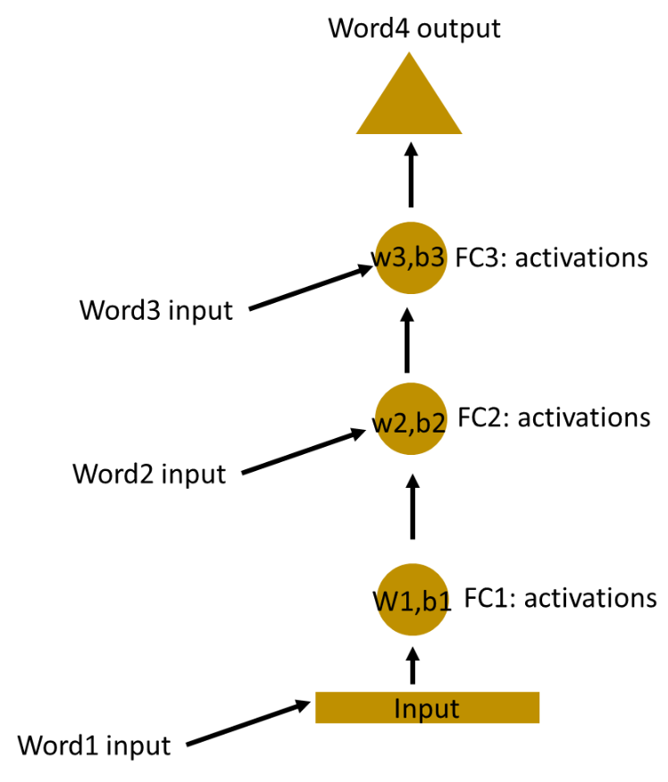

> # **`NLP`**

> ## **`Tokenization`**

Tokenization breaks text into smaller parts for easier analysis.  
Types:

1. Sentence tokenization
    <details>
    <summary>Example</summary>

    ```py
    from nltk.tokenize import sent_tokenize

    text = "Hello everyone. Welcome to GeeksforGeeks. You are studying NLP article."
    sent_tokenize(text)
    ```

    </details>

2. Word tokenization
3. Subword Tokenization
4. Character Tokenization

> ## **`Lemmatization`**

Lemmatization is a process in natural language processing (NLP) that reduces words to their stem or base or dictionary form. Lemmatization does not merely cut words off as you see in stemming algorithms.

<details>
<summary>spaCy</summary>

```py
import spacy

# Load spaCy model
nlp = spacy.load("en_core_web_sm")

text = "running runners easily runs"
# Process text with spaCy
doc = nlp(text)
# Extract lemmas
lemmas = [token.lemma_ for token in doc]
print("Original Text:", text)
print("Lemmatized Text:", lemmas)
```

</details>

<details>
<summary>NLTK</summary>

```py
from nltk.stem import WordNetLemmatizer
import nltk

# Download necessary WordNet data
nltk.download("wordnet")
nltk.download("omw-1.4")

# Initialize WordNet lemmatizer
wnl = WordNetLemmatizer()

# Example inflections to reduce
example_words = ["program", "programming", "programer", "programs", "programmed"]

# Lemmatize each word and store in a list
stemmed_words = [wnl.lemmatize(word, pos="v") for word in example_words]  # 'v' for verbs

# Print the result
print("Original Words:", example_words)
print("Stemmed Words:", stemmed_words)
```

</details>

&nbsp;

> # **`RNN`**

-   Works for sequential data or sequence of information.
-   Temporal data: Related to time.

## Types

1. LSTM (Long Short-Term Memory)
2. Gated Recurrent Units (GRU)
3. Bidirectional RNNs (BiRNNs)
4. Deep RNNs



> ## **`Fine tuning vs Hyper parameter tuning`**


