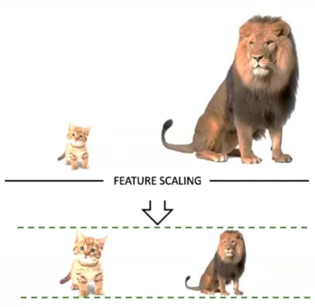

-   K Fold Cross Validation
    -   Validation data: Randomly chosen.
-   Over fitting
    -   Training with big portion of a dataset
-   Under fitting
    -   Data is inaccurate
    -   Fix
        -   Providing sufficient training data

## Confusion Matrix

-   Accuracy is not the sole criteria or parameter to evaluate how good an algorithm is. There are several other factor such as precision, recall etc involve in evaluating an algorithm.
-   Precision formula: `TP/(TP + FP)`
-   Recall formula: `TP/(TP + FN)`
-   F1 Score: `2 * (Precision * Recall) / (Precision + Recall)`
-   In real world scenario, suppose you have a dataset where two different algorithms are collied with a similar accuracy. In this case, precision or other parameters may be used for better pick an algorithm.

&nbsp;

# Feature Scaling, PCA

Feature scaling is also known as feature transformation. কতগুলো random value কে একটা নির্দিষ্ট range (often in smaller numeric range) এর মধ্যে নিয়ে আসাটাই হচ্ছে feature scaling.

-   Scaling is mandatory for KNN, K Means algorithm

### Rules of scaling

-   Only features should be scaled, target value shouldn't be scaled
-   Only numeric, quantitative features should be scaled
-   **Normalization or Min-Max Scaler**: After scaling the features should range between 0 and 1
-   

## Supervised Learning

### Two types

-   **Classification**: যদি target column এর result গুলো কয়েকটি নির্দিষ্ট value এর মধ্যে সীমাবদ্ধ থাকে (যেমন, Yes, No, Good, Bad, Pass, Fail, etc.), তাহলে সেগুলোকে class হিসেবে চিন্তা করা যায় । এগুলোকেই classification problem বলে ।
-   **Regression**: যখন target column এর result গুলো কোন নির্দিষ্ট value এর মধ্যে সীমাবদ্ধ থাকে না, সেগুলোকে regression problem বলে ।

### Target:

### Feature:
