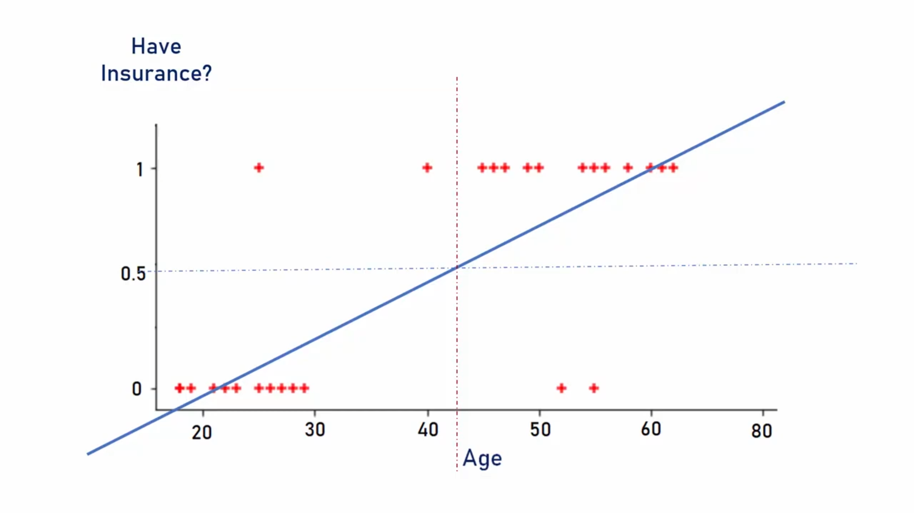

> # **`Logistic Regression`**

Logistic regression is a classification model (despite it name suggest regression model).

Classification types:

1. **Binary classification**: Consist of two classes of categorical data.
2. **Multi-class classification**: Consist of more than two classes of categorical data.

The picture shows that linear regression can't perform good classification

-   Logistic regression draws a semi-curved non-linear line utilizing Sigmoid function along with linear regression formula.
-   Sigmoid function convert any input value in the range from 0 to 1. Here, any predicted value above 0.5 is considered to be 1 and below is considered 0. In rare case, the value 0.5 is known as 'unclassified'.

