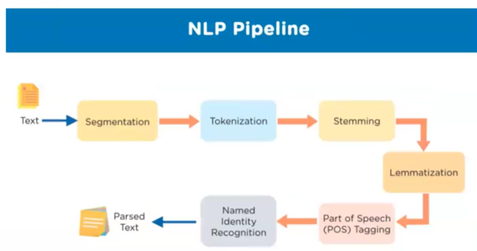

> # NLP

Natural Language Processing is a domain where it discuss and innovate techniques to teach machine to deal with human native languages or instructions.

-   Corpus is language sentence, character and instruction database.

> ## NLP pipeline

1. **Segmentation**:
2. **Tokenization**: Splitting a sentence into words.
3. **Stemming**: 

